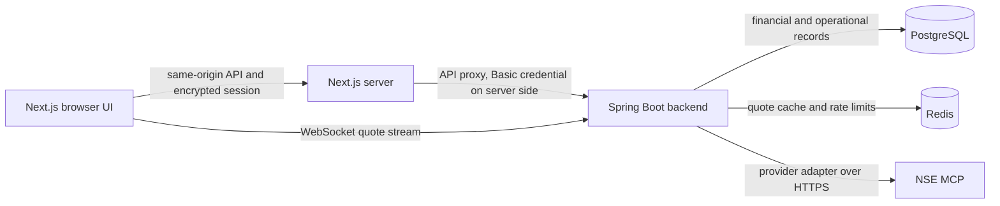

# TradeCore

[](https://github.com/savan2006/tradecore-trading-simulator/actions/workflows/ci.yml)

TradeCore is an educational paper-trading platform for learning how market data, order validation, simulated execution, portfolios, and risk controls fit together. It uses real NSE market data through the NSE MCP adapter, but all accounts, orders, fills, balances, and P&L are simulated. **TradeCore does not place real trades, connect to a broker, handle payments, or use real money.**

Market data is subject to NSE availability and applicable NSE terms. It must not be redistributed. This project is for education and is not investment advice.

## Features

- Market overview, company pages, quote freshness, supported-company comparisons, and learning profiles for an 80-company NSE equity universe.
- Paper MARKET, LIMIT, and STOP_MARKET orders in DELIVERY or INTRADAY mode, order previews and history, simulated executions, a trade journal, portfolio, and performance views.
- Watchlists, price alerts, notifications, risk limits, market calendar, admin operations, reconciliation, completeness, and background-job status pages.
- Quote updates over WebSocket, persisted quotes and candles, and audit events for administrative actions.
- Role and ownership checks, request bounds and rate limits, idempotent order submission, session protection, and operational health endpoints.

## Architecture



PostgreSQL is the source of truth, including for financial state. Redis is only a cache and rate-limit store; cache failure falls back to PostgreSQL or the configured rate-limit behavior. The backend contains feature-based modules for accounts, identity, orders, execution, portfolio, risk, market data, alerts, notifications, and administration. The frontend is a Next.js App Router application with no client-side state-management library.

See [the architecture diagrams](docs/architecture.md) for order, market-data, entity, and WebSocket flows. See [DEPLOYMENT.md](DEPLOYMENT.md) for a no-Docker deployment guide.

## Market data

The backend calls NSE MCP only through the `MarketDataProvider` adapter, validates and normalizes provider responses, then persists accepted quotes in PostgreSQL. The 80-company universe is the set of supported NSE equity instruments seeded by Flyway; it describes project coverage, not a claim that every quote is always available.

Quote status is explicit:

- `LIVE`: a provider quote is usable and fresh.
- `STALE`: the persisted quote exists but is too old for live use.
- `UNAVAILABLE`: no usable quote is available.

Execution eligibility also checks the NSE market session/calendar and quote age (at most 10 minutes). The scheduler refreshes quotes and candles when configured; provider/network outages and market closures can prevent a live update. Never use synthetic quotes in a real database to simulate live data.

## Paper order lifecycle

Orders are validated and, when accepted, enter `PENDING`. The execution scheduler processes eligible orders and records a full fill (`FILLED`) or cancellation (`CANCELLED`). Failed validation is rejected. Although the schema retains a partial-fill status for compatibility, the execution implementation only fills the entire remaining quantity at once; it does not perform partial fills.

Supported types are `MARKET`, `LIMIT`, and `STOP_MARKET`; supported modes are `DELIVERY` and `INTRADAY`. Buy orders reserve virtual funds, and sell orders reserve sellable position quantity. A sell cannot create a short position. Risk limits, account ownership, market-session eligibility, and quote freshness are checked before simulated execution. Intraday positions and orders are handled by the square-off scheduler. All money and prices use decimal values.

## Quote WebSocket and Redis

Clients connect to `/ws/market-quotes` and subscribe or unsubscribe by NSE symbol. The backend publishes provider-neutral quote messages after the quote has been persisted, using bounded asynchronous send queues and per-client limits. WebSocket origins are allowlisted. The broadcaster is in-process, so run one backend instance unless cross-instance quote fan-out and scheduler coordination are added.

Redis stores market-data cache entries and supports rate limits. PostgreSQL retains the authoritative quote, account, order, and execution records. A Redis outage must not change financial truth.

## Security

The backend uses HTTP Basic credentials on server-to-server API requests. The Next.js server encrypts the login credential into an `httpOnly`, `SameSite=Strict` cookie; `SESSION_SECRET` is required, and production cookies are secure-only. The frontend checks same-origin session requests and proxies API calls without exposing the credential to browser JavaScript. Backend authorization checks roles and resource ownership; CORS and WebSocket origins are configured explicitly. Production disables the development login user and API documentation by default.

## Technology and versions

Versions declared by the project manifests:

- Java 21 and Spring Boot 4.1.1; Maven project `com.tradecore:tradecore-backend:0.1.0-SNAPSHOT`.
- Springdoc OpenAPI 3.1.1.
- Next.js 16.4.0, React 19.3.0, and TypeScript 7.0.2; Node.js `>=22 <25`.
- PostgreSQL via Spring Data JPA/Flyway and Redis via Spring Data Redis.

## Local setup

Prerequisites: Java 21, Maven, Node.js in the supported range, and reachable PostgreSQL and Redis instances. The backend runs Flyway migrations at startup. Copy the placeholder values from `frontend/.env.example` to your local frontend environment and configure backend variables as listed in [DEPLOYMENT.md](DEPLOYMENT.md). Never put real credentials in tracked files.

Start the backend from `backend/`:

```powershell
mvn spring-boot:run
```

Start the frontend from `frontend/`:

```powershell
npm ci
npm run dev
```

The frontend API proxy defaults to `http://localhost:8080`; configure `TRADECORE_BACKEND_URL` when the backend uses another address. `NEXT_PUBLIC_API_BASE_URL` sets the browser-facing API base for the WebSocket fallback. `NEXT_PUBLIC_WEBSOCKET_URL` can override the full socket endpoint. On HTTPS pages the client uses `wss:`.

## Tests and API documentation

Run backend tests from `backend/` with Java 21:

```powershell
mvn test
```

The backend suite uses H2 for isolated test databases and does not require a real NSE quote, live market session, or production database. Do not weaken freshness or market-session checks to make tests pass.

Run frontend checks from `frontend/`:

```powershell
npx tsc --noEmit
npm run build
```

When API docs are enabled (`TRADECORE_DOCS_ENABLED=true`, the local default), Swagger UI is at `/swagger-ui/index.html` and the OpenAPI document is at `/v3/api-docs`. The production profile disables API docs by default.

## Known limitations

- Market-data access depends on NSE MCP reachability, market hours, and the provider's returned data. A live quote change cannot be verified while the market is closed or the provider is unavailable.
- Quote broadcasting and scheduled jobs are in-process; horizontal backend scaling needs coordination and shared quote fan-out.
- This is a learning simulator, not a broker, exchange, financial ledger service for real funds, or production execution system. All order fills are simulated and complete-only.

For intentional cloud cleanup of synthetic accounts only, review [`scripts/cleanup-synthetic-data.sql`](scripts/cleanup-synthetic-data.sql). It targets `@example.invalid` users, previews affected row counts, and ends with `ROLLBACK`; inspect the preview and change the transaction ending only when deletion is explicitly intended.

## Screenshots

Dashboard: screenshot placeholder — add an approved dashboard image here.

Market page: screenshot placeholder — add an approved market page image here.

Portfolio and orders: screenshot placeholder — add approved portfolio/order images here.
