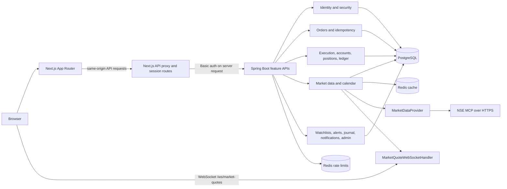
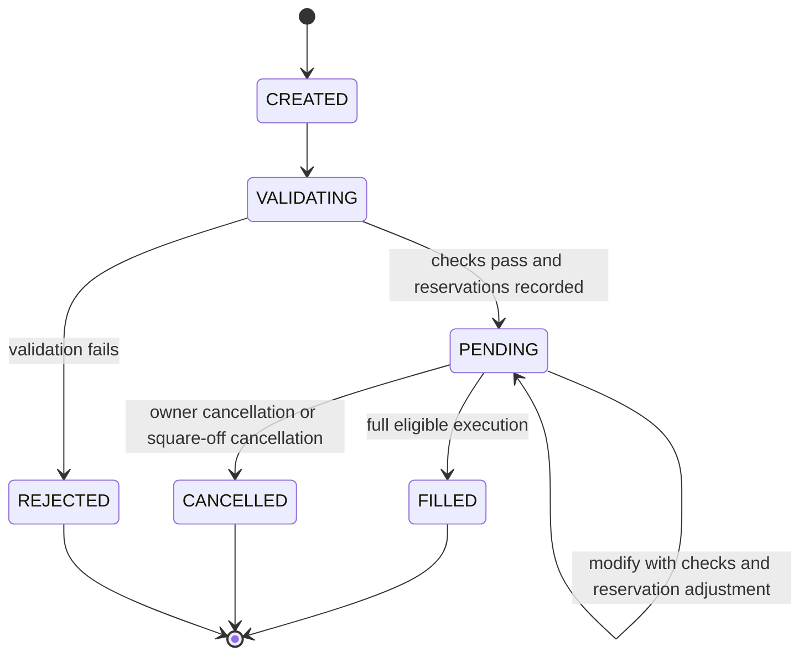
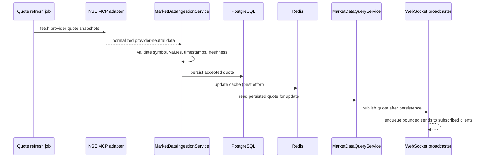
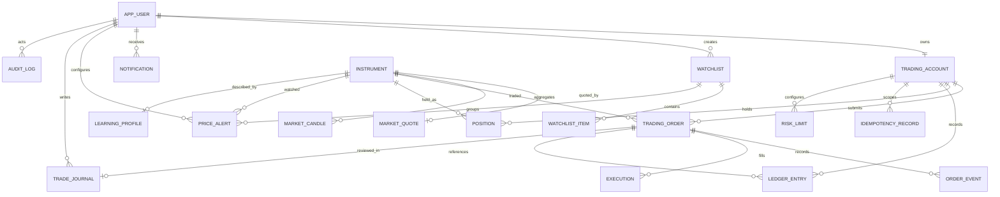
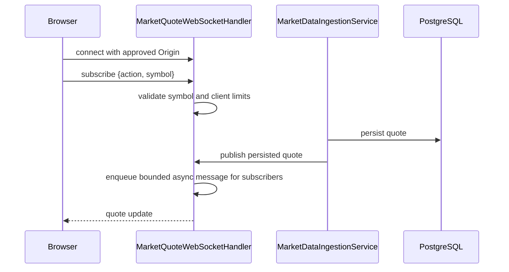

# TradeCore architecture

These diagrams describe the current code paths. PostgreSQL is authoritative for financial state; Redis is only used for market-data caching and rate limits.

## System architecture

## Order lifecycle

Buy orders reserve funds and sell orders reserve available position quantity. Market session, quote freshness, risk, ownership, and idempotency are enforced in the request and execution paths. Fills are complete-only; no short selling or partial execution is supported.

## Market-data flow

The provider adapter is the only NSE integration boundary. Quote freshness is represented as `LIVE`, `STALE`, or `UNAVAILABLE`; stale or unavailable quotes are not eligible to execute an order. The market calendar/session policy is checked separately from provider freshness.

## Main entity relationships

`market_session` is keyed by trading date and has no user relationship. User-owned trading rows connect through `trading_account` or `app_user`; instruments, quotes, candles, learning profiles, and market sessions are shared reference/market data.

## WebSocket flow

The handler restricts allowed origins, message size/rate, subscriptions, and connected clients. Sends run through a bounded worker queue and each client has a bounded pending-quote queue. Fan-out is local to one backend process; multiple instances need a shared pub/sub design and scheduler coordination.
